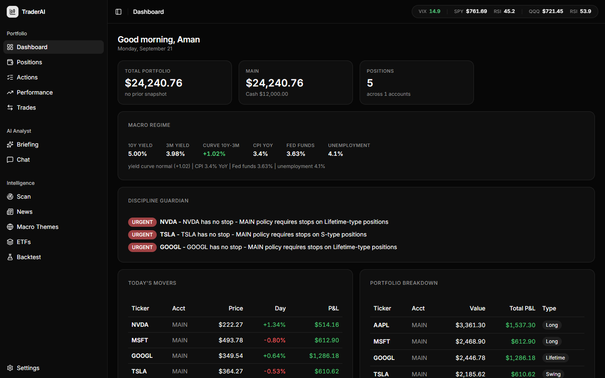
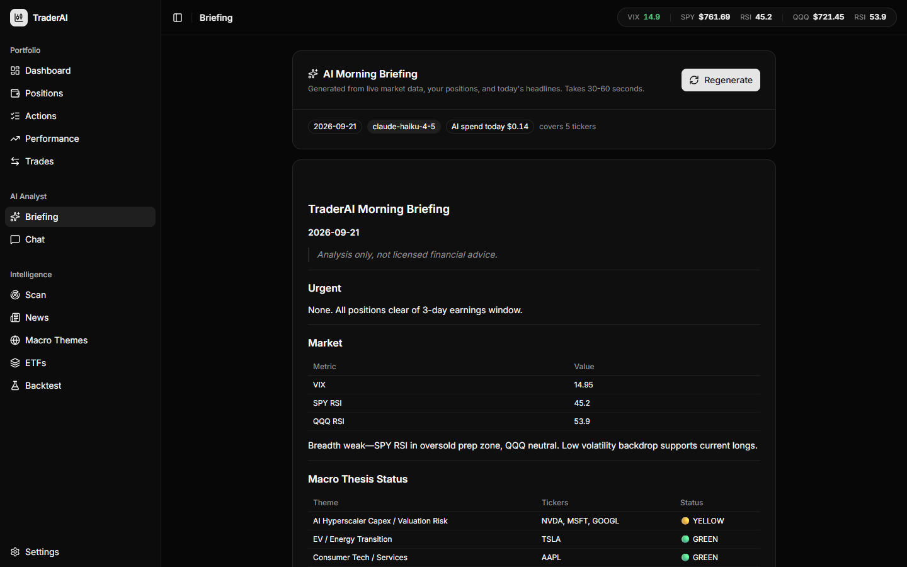
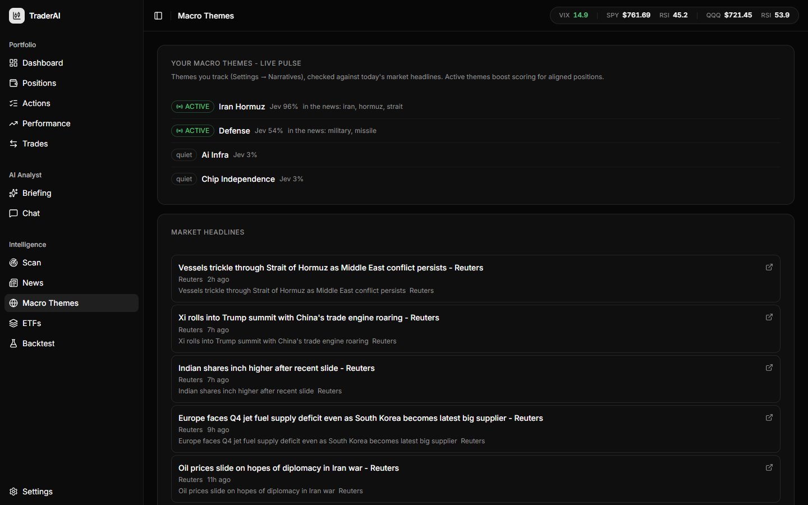

# TraderAI

     

> **Not investment advice.** TraderAI is analysis tooling for your own portfolio, run on your own machine with your own keys. It never executes trades - you confirm every action at your broker. See [Disclaimer](#disclaimer).

## The problem

Last spring I was holding a chip stock I really believed in. One Tuesday it jumped double digits overnight - earnings. I didn't even know they reported that night. The signals had been sitting in plain sight for days: unusual call buying, the supplier upstream had already beaten, prediction markets had the beat priced at 90%+. I just had no system watching any of it.

That stung, so I looked at what the professionals use. A Bloomberg Terminal is about **$24,000 a year**. Retail "AI trading" platforms run $50-150 a month, and most of them are a chat window that confidently makes up numbers, knows nothing about *your* portfolio, and wants your holdings uploaded to someone else's cloud. Free ChatGPT? Ask it about your positions and it will hallucinate a price, an RSI, and a P&L - all wrong, all delivered with total confidence.

The data to do this properly is mostly **free** - yfinance prices, SEC filings, Fed economic data, treasury yields, earnings-call transcripts, options chains. What's missing is the machine that watches it every morning, checks it against *your* rules, and tells you what actually needs a decision today. So I built that machine, and made the AI part physically incapable of inventing numbers: it can only speak from data it just fetched.

**TraderAI is the result**: a self-hosted trading intelligence platform with an opinionated scoring engine, a risk engine that enforces your own rules, and an AI analyst that briefs you every morning - for about **$1-2 a month** in API costs, total.

## Screenshots

**The dashboard**: live P&L, macro regime from Fed data, and a discipline guardian that checks the portfolio against your own rules.



**The AI Morning Briefing**: generated from live prices, your positions, and today's headlines. Note the badge: that day's total AI spend was $0.14.



**Macro Themes**: the themes you track, scored against today's real headlines with calibrated Jev probabilities. A Reuters Hormuz headline lights up Iran Hormuz at 96% while quiet themes sit at 3%.



## What makes this different from other "AI trading" platforms

| Most AI trading products | TraderAI |
|---|---|
| Your portfolio lives on their servers | **Self-hosted.** Your positions, rules, and history never leave your machine - the only outbound traffic is the data APIs you configure |
| The AI free-styles numbers from memory | **Grounded by construction.** The analyst answers through tools - live snapshots, the scoring engine, the backtester. If it didn't fetch a number, it can't say it |
| One chat model doing everything | **Two-model architecture.** Claude (Haiku/Sonnet) writes the reasoning and briefings; TypeSafe Jev returns calibrated *probabilities* for in-pipeline signals (is this headline thesis-breaking? 0.96). Right tool per job |
| One-size-fits-all signals | **Your rules are the code.** An onboarding wizard builds your risk config - earnings blackout, position caps, drawdown limit, stop style - and the scorer, position sizing, action items, and every AI prompt derive from it. A discipline guardian flags you when you break your own rules |
| "Trust our win rate" | **Evidence over vibes.** Built-in 730-day backtester with walk-forward validation and bull/bear regime segmentation. It has already caught one of its own thresholds as curve-fit. The AI can run backtests mid-chat to answer "would rule X have worked?" |
| Auto-trades your account | **Never executes.** Bounded delegation: it analyzes, you decide, you confirm at your broker |
| $50-150/month subscription | **MIT-licensed, bring your own keys, ~$1-2/month** |

## How is it this cheap?

Two reasons: the data is free if you know where to look, and the AI spend is engineered down and then capped.

| Source | What it provides | Cost |
|---|---|---|
| yfinance | Prices, history, options chains, fundamentals, ATR | $0 |
| SEC EDGAR | Form 4 insider buys, 10-K customer concentration | $0 |
| FRED (free key) | CPI, Fed funds, unemployment | $0 |
| Treasury index tickers | Yield curve + inversion flag | $0 |
| Finnhub free tier | Market headlines, data fallback | $0 |
| earningscall.biz free tier | Full earnings-call transcripts | $0 |
| TypeSafe free tier | Jev probability judgments | $0 |
| Anthropic API | Briefings, chat, debates | **~$1-2/mo** |

The AI bill stays tiny by design, not luck: **Haiku by default** (the cheapest capable model - pennies per day), one cached briefing per day, batched prompts (all scan explanations in a single call), aggressive caching of every signal (insider 24h, options 4h, macro 24h, transcripts 7d), and a **hard daily budget cap enforced in code** - when today's spend hits your limit (default $1), AI calls stop. The app shows your spend per day.

## What it does

**Analytics engine (Python)**
- **180-point entry scoring** over 14 factors (RSI, MACD, Bollinger %, FCF yield, insider buying, macro-narrative alignment…) with hard disqualifiers and a backtested falling-knife guard
- **150-point spec scorer** for pre-profit small caps - cash runway, dilution, customer concentration instead of FCF
- **Lead indicators** that move before price: SEC Form 4 insider signals, options flow + gamma walls, supply-chain upstream reads
- **Universe scanner** (~350 stocks, one click from the UI), earnings calendar with disqualifier warnings, dividend calendar, monthly recap, market breadth
- **730-day backtester** with bootstrap-CI guard validation and 60-day forward logs for every experimental signal
- **SQLite signal store** - every day's computed signals are logged, building your own research dataset for free

**AI analyst (Claude)**
- **AI Morning Briefing** - one click generates a full briefing from live prices, your positions, and today's headlines: urgent items, macro thesis status per holding, position notes, numbered decisions. Mandatory pre-earnings decision cards (bull case / bear case / explicit recommendation), with the latest earnings-call transcript as evidence.
- **Portfolio Chat** - ask "should I trim NVDA before earnings?" and the model answers by calling the system's own tools: live snapshots, the scoring engine, news, options flow, insider signals, the discipline guardian, even the backtester.
- **Bull vs Bear debate agent** - two AI advocates argue a ticker from the same fetched evidence, a judge issues the verdict and an explicit recommendation (3 small calls, ~1 cent).
- **Jev typed judgments** (TypeSafe) - calibrated probabilities for thesis-breaking news, live macro-narrative pulse, and big-move explanations. Degrades to a keyword classifier without a key.
- **AI scan explanations** - one grounded sentence per top scan candidate, cached per scan run.

**Risk engine - your rules, computed**
- ATR-based stops and volatility-scaled position sizing: `max_risk_per_trade_pct` becomes an enforced share count, not advice
- Structured trade setups (entry / stop / target / shares / $risk / $reward / R:R) - every number computed by code, the AI only writes the thesis
- **Discipline guardian**: live compliance report against your own rules - position caps, stops required, cash floor, portfolio heat, drawdown hard stop, stale swing positions
- **Macro regime layer**: treasury yield curve + inversion flag, CPI / Fed funds / unemployment
- Walk-forward validation + bull/bear regime segmentation in `ml_calibrate.py` - thresholds must survive out-of-sample and both market regimes

**Personalized to each user - nothing hardcoded**
- **Onboarding wizard**: profile and risk questionnaire → your accounts (any names, any policies) → your actual holdings via a **live ticker search** (type "nvidia", pick the exact listing, live price prefilled) → rules from a preset (Conservative Income / Balanced Swing / Aggressive Growth / Spec Hunter), every value editable → macro themes → AI behavior
- Manage funds anytime: deposit, withdraw, or set balances per account
- Settings page to revisit everything; paper-mode flag; portfolio reset

**Dashboard (React 19 + Vite + shadcn/ui + Tailwind v4)**
- Monochrome fintech theme: portfolio dashboard with equity curve and personalized greeting, live P&L tables, click-through ticker charts (price/MA50/MA200/RSI with your stop marked), prioritized action items, scan results, live macro-themes feed with clickable headlines, news per holding, ETF watchlist
- **Backtest lab**: run the historical validator from the UI - tier performance table, alpha-by-score chart, per-entry drill-down

## Quick start

```bash
# 1. Backend deps
pip install -r requirements.txt

# 2. Keys (all optional except ANTHROPIC_API_KEY for AI features)
cp .env.example .env   # then fill in - see "Environment" below

# 3. Run the API
python -m uvicorn api:app --app-dir backend --reload --port 8000

# 4. Run the frontend
cd frontend && npm install && npm run dev   # http://localhost:5173
```

First launch opens the **setup wizard**: your accounts, cash on hand, existing
holdings, risk rules from a preset, macro themes, and AI behavior. Everything
lives in local gitignored files - nothing leaves your machine except the API
calls you configure.

To enable Buy/Sell/Funds from the UI, mirror your API token for the frontend:
create `frontend/.env.local` containing `VITE_API_TOKEN=<your TRADING_API_TOKEN>`
(gitignored - dev-server only).

CLI (no server needed):

```bash
python backend/morning_run.py          # full terminal morning briefing
python backend/score.py NVDA           # score any ticker (auto-routes spec names)
python backend/scan_universe.py --quick
python backend/backtest.py --full --lookback 730 --hold 60 --save
python backend/ml_calibrate.py         # learn entry threshold from backtest evidence
pytest tests/ -q                       # 306 tests
```

### Environment (`.env` - gitignored)

```
ANTHROPIC_API_KEY=   # AI briefing, portfolio chat (console.anthropic.com)
TYPESAFE_API_KEY=    # optional - Jev typed judgments (typesafe.ai)
TRADING_API_TOKEN=   # any random string; required for buy/sell/stop/cash endpoints
FRED_API_KEY=        # optional - CPI/Fed/unemployment (fred.stlouisfed.org, free)
FINNHUB_KEY=         # optional data providers - yfinance works with no keys
NEWSAPI_KEY=
TWELVEDATA_KEY=
ALPHAVANTAGE_KEY=
SEC_CONTACT_EMAIL=   # your email - SEC EDGAR fair-access policy
```

Works on Windows, macOS, and Linux (UTF-8 I/O throughout; no platform-specific calls).

## Repository layout

```
├── backend/       # Python engine: API, scoring, risk, AI layer, pipeline (all modules)
├── frontend/      # React 19 + shadcn/ui dashboard (Vite)
├── tests/         # 306 hermetic pytest tests
├── scripts/       # Windows Task Scheduler installer
├── docs/          # ROADMAP, SECURITY, example strategy playbook
├── data/          # runtime caches + SQLite signal store (gitignored)
└── *.json / .env  # portfolio, config, and caches live at the root (gitignored)
```

## Architecture

```
                    ┌────────────────────────────────────────┐
                    │        React 19 + shadcn/ui            │
                    │  Dashboard · Positions · Actions ·     │
                    │  Scan · News · AI Briefing · AI Chat   │
                    └───────────────┬────────────────────────┘
                                    │ TanStack Query
                    ┌───────────────▼────────────────────────┐
                    │           FastAPI (api.py)             │
                    │  reads: positions/prices/score/news    │
                    │  writes (token-auth): buy/sell/stop    │
                    │  AI: /briefing /chat /sentiment        │
                    └──┬──────────────┬──────────────┬───────┘
                       │              │              │
        ┌──────────────▼───┐  ┌───────▼────────┐  ┌──▼──────────────────┐
        │  Analytics core  │  │   AI layer     │  │  Data providers     │
        │ score/spec_score │  │ ai_client.py   │  │ yfinance (free)     │
        │ action_engine    │  │ ai_analyst.py  │  │ Finnhub/TwelveData/ │
        │ patterns/insider │  │ jev_signals.py │  │ AlphaVantage/News   │
        │ options_flow     │  │ Claude + Jev   │  │ fallback chain      │
        │ backtest         │  └────────────────┘  └─────────────────────┘
        └──────────────────┘
```

The AI layer has a deliberate division of labor:

| Layer | Model | Job |
|---|---|---|
| `jev_signals.py` | TypeSafe Jev (System One) | Typed, calibrated probabilities inside the pipeline - thesis-negative news, narrative pulse, mover explanation. Fast + cheap, runs per ticker. |
| `ai_analyst.py` | Claude Sonnet / Haiku | Narrative + reasoning - the morning briefing, pre-earnings decision cards, debates, tool-use portfolio chat. |
| `community_*.py` | Claude Haiku | Cheap one-shot sentiment classification for Reddit/YouTube signals. |

Every AI feature degrades gracefully when its key is missing - the system falls back to keyword classification and stays fully functional.

## Key modules

| Module | Purpose |
|---|---|
| `api.py` | FastAPI backend - all read endpoints + token-authenticated mutations |
| `morning_run.py` | Daily pipeline orchestrator (parallel snapshots → patterns → news → alerts → action items → `daily_brief.json`) |
| `score.py` / `spec_score.py` | 180-pt regular / 150-pt spec scoring with auto-routing |
| `action_engine.py` | Multi-signal synthesis → prioritized action items (URGENT/ACTION/WATCH/INFO) |
| `risk_engine.py` / `guardian.py` | ATR stops, risk-based sizing, trade setups / rule-compliance checks |
| `ai_client.py` | Shared Anthropic client, model tiers, usage + cost tracking, budget cap |
| `ai_analyst.py` | AI briefing generator, debate agent, tool-use portfolio chat (11 tools) |
| `jev_signals.py` | TypeSafe Jev typed judgments (probabilities, not text) |
| `data_client.py` | Provider fallback chain with per-provider rate-limit tracking |
| `insider.py` / `options_flow.py` | SEC Form 4 signals (24h cache) / P/C ratio + gamma walls (4h cache) |
| `backtest.py` / `ml_calibrate.py` | Historical validation / walk-forward + regime-segmented threshold calibration |
| `signal_store.py` / `persistence.py` | SQLite signal history / file-locked portfolio I/O |
| `user_config.py` | Per-user profile, accounts, rules, presets - drives the engine and AI prompts |

## API surface

| Endpoint | Auth | Description |
|---|---|---|
| `GET /api/positions` `/history` `/trades` `/market` `/prices` | - | Portfolio + live market data |
| `GET /api/score/{ticker}` `/trade-setup/{ticker}` `/chart/{ticker}` | - | Scoring, risk-sized setups, chart series |
| `GET /api/action-items` `/guardian` `/macro` `/macro-news` | - | Action synthesis, rule compliance, macro regime + themes |
| `GET /api/news/{ticker}` `/news-all` `/sentiment/{ticker}` | - | News + keyword/Jev sentiment |
| `GET /api/briefing` `/debate/{ticker}` `/scan-explanations` `/ai-status` | - | AI analyst features |
| `POST /api/chat` | - | Tool-use portfolio chat |
| `GET/PUT /api/config` `/config/presets` | - | User rules, accounts, presets (drives engine + AI) |
| `POST /api/scan/run` `/backtest/run` (+ status/results) | - | Scanner + backtest runners |
| `POST /api/setup/portfolio` | first-run open | Wizard portfolio creation (token-gated after onboarding) |
| `POST /api/buy` `/sell` `/stop` `/cash` `/reset-portfolio` | `X-API-Token` | Portfolio mutations (constant-time compare) |

## 180-point entry algorithm

| Factor | Max pts |
|--------|---------|
| RSI oversold (<30 = 25, <40 = 15) | 25 |
| MACD histogram improving | 20 |
| BB% oversold | 20 |
| Upside to 52W high | 20 |
| Volume surge / dividend / rel. strength / analyst / short interest | 40 |
| Below 200MA · FCF yield · near 52W low | 25 |
| Macro narrative alignment | 10 |
| Insider buying (Form 4) | 10 |
| Falling-knife guard | −10 |

Thresholds are yours to set (defaults: ≥70 candidate · ≥110 strong · ≥140 conviction).
Auto-disqualifiers: earnings inside your blackout window · D/E >200 · negative FCF · bearish pattern.

The spec scorer (auto-routed when market cap <$5B with negative FCF, >50% growth, or <$10 price) replaces the FCF check with **cash runway**, and scores dilution, customer concentration (SEC EDGAR 10-K parsing), catalyst proximity, and squeeze potential. Backtest (730d, ~350 tickers): the falling-knife guard improved median 60-day alpha by up to **+3.8pp**, and only the ≥70 tech tier survived both walk-forward validation and both market regimes.

## Security notes

- Mutation endpoints require `X-API-Token` (constant-time comparison); optional `REQUIRE_READ_AUTH=1` locks every endpoint
- `positions.json`, config, trade logs, briefings, and all caches with financial data are gitignored
- CORS locked to localhost dev origins; 12s socket timeout on all network calls
- Intended to run locally - do not expose the API to the public internet as-is

## Tests

`pytest tests/ -q` - 306 tests over the scorers, router, action engine, risk engine, guardian, signal store, AI layer, news classification, insider/options caching, portfolio setup, and CLI. CI runs the suite plus the frontend build on every push.

## Scheduling

- **Windows**: `.\scripts\install_windows_task.ps1` - Scheduled Task running the morning pipeline weekdays at 7:00 AM (`-Time "06:30"` to change, `-Remove` to uninstall)
- **macOS/Linux**: cron - `30 6 * * 1-5 cd /path/to/traderai && python backend/morning_run.py`

## Disclaimer

TraderAI is an educational and personal-analysis tool. It is **not investment advice**, and its outputs - scores, briefings, debates, trade setups - are automated analysis with no guarantee of accuracy or profitability. Markets involve risk of loss. The AI can be wrong; the data (free-tier sources) can be delayed or wrong. You are solely responsible for your trading decisions. Consult a licensed financial advisor for advice.

## Contributing & License

PRs welcome - see [CONTRIBUTING.md](CONTRIBUTING.md). MIT licensed.
